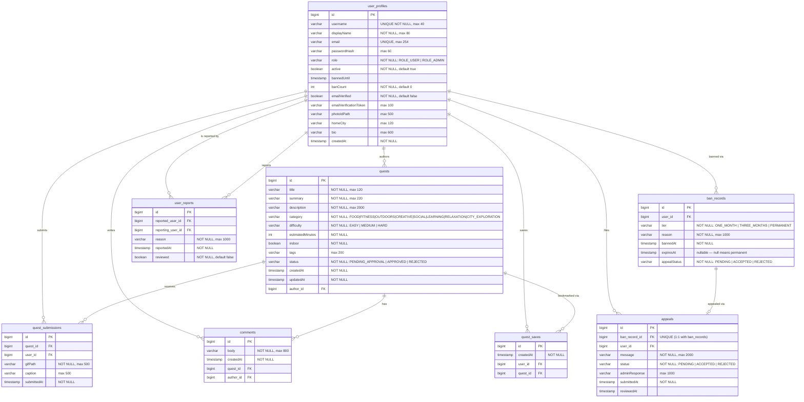

# MicroQuest

MicroQuest is a full-stack Spring Boot web app for a fun challenge-sharing platform. Users register, browse micro-adventure quests, submit GIF completions with captions, and compete on a leaderboard. Admins can manage quests, users, and appeals.

## Tech stack

- Java 21
- Spring Boot 3.5
- Spring MVC + Spring Security
- Thymeleaf
- Spring Data JPA
- PostgreSQL 17
- Maven
- Bootstrap 5 via CDN

## Prerequisites

Before running the app, make sure the following are installed on your machine:

| Requirement | Version | Notes |
|---|---|---|
| JDK 21 | 21+ | Set `JAVA_HOME` to the JDK 21 directory |
| Maven | 3.9+ | Must be on `PATH` |
| PostgreSQL | 17 | Running as a local Windows service (`postgresql-x64-17`) |

### One-time database setup

Open a terminal and run:

```sql
psql -U postgres
CREATE DATABASE microquest;
CREATE USER microquest WITH PASSWORD 'microquest';
GRANT ALL PRIVILEGES ON DATABASE microquest TO microquest;
\q
```

The app uses `ddl-auto=update`, so tables are created automatically on first launch. Sample seed data is inserted when the database is empty.

## Starting the app (Windows — simplest method)

From the project root, double-click **`start.bat`** or run in a terminal:

```bat
start.bat
```

Or from PowerShell:

```powershell
.\start.ps1
```

The launcher will:
1. Set `JAVA_HOME` and add PostgreSQL `bin` to `PATH`
2. Verify the PostgreSQL service is running (starts it if stopped)
3. Run `mvn spring-boot:run`
4. Open Chrome automatically once the app is ready at `http://localhost:8080`

## Starting the app manually

If you prefer to manage things yourself:

```powershell
# 1. Set Java 21 (adjust path to match your installation)
$env:JAVA_HOME = "C:\jdk21\jdk-21.0.8"
$env:PATH = "$env:JAVA_HOME\bin;" + $env:PATH

# 2. Start PostgreSQL (if not already running)
Start-Service postgresql-x64-17

# 3. Run the app
mvn spring-boot:run
```

Then open `http://localhost:8080` in your browser.

## Database settings

Configured in `src/main/resources/application.properties`:

| Setting | Value |
|---|---|
| Database | `microquest` |
| Username | `microquest` |
| Password | `microquest` |
| Host | `localhost` |
| Port | `5432` |

## Features

- User registration and login with Spring Security
- Quest browsing, creation, and detail pages
- Multi-GIF submission with per-GIF captions (up to 50 MB per request)
- Private GIF access — only the submitting user (or admin) can view their files
- GIF deletion by the owner
- Leaderboard
- Admin dashboard: manage users, quests, reports, and appeals
- Seed data loaded automatically on first run

## Database Schema (ERD)



> **Unique constraint:** `quest_saves(user_id, quest_id)` — a user can bookmark each quest only once.
>
> **Enum values** are stored as strings in PostgreSQL (`EnumType.STRING`).

## Development notes

- `spring.jpa.hibernate.ddl-auto=update` — schema is kept in sync automatically
- `spring.thymeleaf.cache=false` — template changes take effect without restart
- GIF files are stored locally in the `uploads/gifs/` directory (gitignored)
